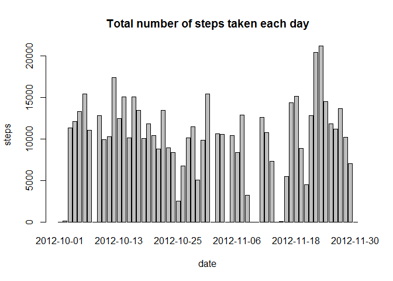

First, load the required libraries that are needed later.

```r
chooseCRANmirror(graphics=FALSE, ind=1)
if (!("dplyr" %in% library())) install.packages("dplyr",type="binary",quiet=TRUE)
library(dplyr)
if (!("lattice" %in% library())) install.packages("lattice",quiet=TRUE)
library(lattice)
```

## Loading and preprocessing the data
Load the data:

```r
con <- unz(description="activity.zip",filename="activity.csv")
activity <- read.csv(con)
```

Explore the data:

```r
str(activity)
```

```
## 'data.frame':	17568 obs. of  3 variables:
##  $ steps   : int  NA NA NA NA NA NA NA NA NA NA ...
##  $ date    : Factor w/ 61 levels "2012-10-01","2012-10-02",..: 1 1 1 1 1 1 1 1 1 1 ...
##  $ interval: int  0 5 10 15 20 25 30 35 40 45 ...
```


```r
summary(activity)
```

```
##      steps                date          interval     
##  Min.   :  0.00   2012-10-01:  288   Min.   :   0.0  
##  1st Qu.:  0.00   2012-10-02:  288   1st Qu.: 588.8  
##  Median :  0.00   2012-10-03:  288   Median :1177.5  
##  Mean   : 37.38   2012-10-04:  288   Mean   :1177.5  
##  3rd Qu.: 12.00   2012-10-05:  288   3rd Qu.:1766.2  
##  Max.   :806.00   2012-10-06:  288   Max.   :2355.0  
##  NA's   :2304     (Other)   :15840
```
Further preprocessing of the data is not necessary.

## What is mean total number of steps taken per day?
Calculate the total number of steps taken each day. `NA`'s are removed.

```r
steps_per_day <- activity %>%
    group_by(date) %>%
    summarise(steps=sum(steps,na.rm=TRUE))
```

Plot the resulting data.

```r
barplot(steps~date, steps_per_day, main="Total number of steps taken each day")
```

<!-- -->

Calculate the mean and median of the total number of steps for all days.

```r
mean_total_daily_steps <- mean(steps_per_day$steps)
mean_total_daily_steps
```

```
## [1] 9354.23
```

```r
median_total_daily_steps <- median(steps_per_day$steps)
median_total_daily_steps
```

```
## [1] 10395
```
The **mean** of the total daily steps is 9354.23 and the **median** of the total daily steps is
10395.

## What is the average daily activity pattern?
Calculate the number of steps in each 5-minute interval averaged over all days in the dataset. `Na`'s are removed.

```r
steps_by_interval <- activity %>%
    group_by(interval) %>%
    summarise(steps=mean(steps,na.rm=TRUE))
```

Plot the resulting data.

```r
plot(steps~interval, steps_by_interval, type="l", main="Daily average number of steps in each 5-minute interval")
```

<!-- -->

Calculate the 5-minute interval that, on average over all days, contains the maximum number of steps.

```r
max_int <- which.max(steps_by_interval$steps)
max_interval <- steps_by_interval[max_int,]$interval
max_interval
```

```
## [1] 835
```
The 5-minute interval that on average over all days contains the maximum number of steps is 835.

## Imputing missing values
Calculation of the total number of missing values in the dataset.

```r
total_NA <- colSums(is.na(activity))
```
There are 2304 rows with `NA`'s in the `activity` dataset.

I decided to replace missing values by the mean steps of the corresponding interval.

```r
activity_noNAs <- activity
for (i in 1:nrow(activity_noNAs)) {
    if (is.na(activity_noNAs[i,"steps"])) {
        impute_steps <- steps_by_interval[steps_by_interval$interval==activity_noNAs[i,"interval"],"steps"]
        activity_noNAs[i,"steps"] <- as.integer(impute_steps)
    }
}
```
Calculate the total steps per day on the dataset with imputed NAs.

```r
steps_per_day_noNAs <- activity_noNAs %>%
    group_by(date) %>%
    summarise(steps=sum(steps))
```
The corresponding plot is as follows:

```r
barplot(steps~date, steps_per_day_noNAs, main="Total number of steps taken each day")
```

<!-- -->

Calculate the mean and median of the total number of steps for all days.

```r
mean_total_daily_steps_noNAs <- mean(steps_per_day_noNAs$steps)
mean_total_daily_steps_noNAs
```

```
## [1] 10749.77
```

```r
median_total_daily_steps_noNAs <- median(steps_per_day_noNAs$steps)
median_total_daily_steps_noNAs
```

```
## [1] 10641
```
The **mean** of the total daily steps is 10749.77 and the **median** of the total daily steps is
10641. These values differ from the case with NAs ignored.


```r
t <- data.frame(mean  =c(  mean_total_daily_steps,  mean_total_daily_steps_noNAs),
                median=c(median_total_daily_steps,median_total_daily_steps_noNAs)
                ,row.names=c("NAs ignored","NAs imputed")
                )
t
```

```
##                 mean median
## NAs ignored  9354.23  10395
## NAs imputed 10749.77  10641
```
Apparently the mean and median with NAs imputed are bigger than those with NAs ignored.

## Are there differences in activity patterns between weekdays and weekends?
Create a new factor variable `daytype` in the dataset `activity_noNAs` with two levels – “weekday” and “weekend” indicating whether a given date is a weekday or weekend day.

```r
Sys.setlocale("LC_ALL","English_US")
```

```
## [1] "LC_COLLATE=English_United States.1252;LC_CTYPE=English_United States.1252;LC_MONETARY=English_United States.1252;LC_NUMERIC=C;LC_TIME=English_United States.1252"
```

```r
activity_noNAs$daytype <- factor(ifelse(weekdays(as.Date(activity_noNAs$date)) %in% c("Saturday","Sunday"), "weekend", "weekday") )
str(activity_noNAs$daytype)
```

```
##  Factor w/ 2 levels "weekday","weekend": 1 1 1 1 1 1 1 1 1 1 ...
```
Calculate the number of steps in each 5-minute interval averaged over weekday and weekend.

```r
steps_by_interval_noNAs <- activity_noNAs %>%
    group_by(interval,daytype) %>%
    summarise(steps=mean(steps))
```
The time series of the daily-averaged 5-minute interval steps of weekdays and weekends is shown below:

```r
xyplot(steps ~ interval | daytype, steps_by_interval_noNAs, type="l", layout=c(1,2))
```

<!-- -->

